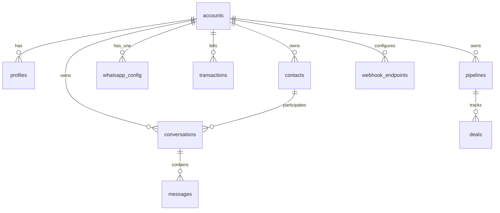
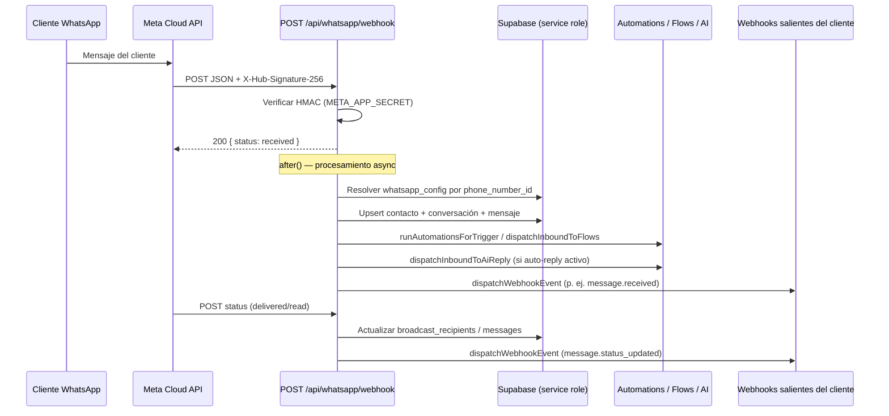
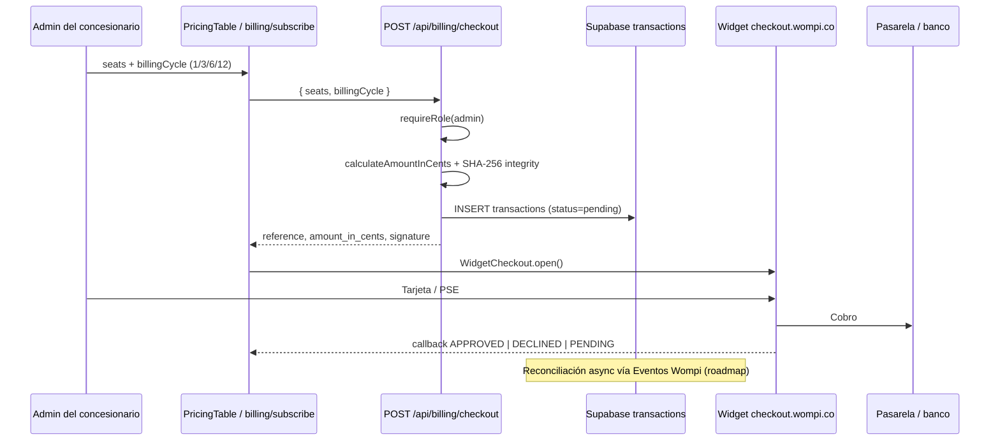

# Arquitectura — REVIO CRM

Documento de referencia para operadores, integradores y desarrolladores. Describe el diseño del CRM automotriz multi-tenant basado en **wacrm** (Next.js + Supabase), incluyendo los módulos custom de facturación B2B con **Wompi** y moneda **COP**.

---

## 1. Visión general del sistema

**REVIO CRM** es un CRM B2B orientado a concesionarios automotrices en Colombia. Cada **concesionario** opera como un **tenant** aislado (`accounts`). Los equipos de ventas comparten:

- Un **inbox de WhatsApp** (Meta Cloud API) con asignación de conversaciones.
- **Contactos**, etiquetas y campos personalizados.
- **Pipelines comerciales** (Kanban) vinculados a conversaciones.
- **Broadcasts** con plantillas aprobadas por Meta.
- **Automatizaciones** y **Flows** visuales (respuestas, etiquetas, webhooks).
- **Asistente IA** (BYOK: OpenAI / Anthropic, claves cifradas por cuenta).
- **Facturación de licencias** por asesor vía **Wompi** (COP, ciclos 1/3/6/12 meses con descuento).

### Modelo multi-tenant

| Concepto | Implementación |
|----------|----------------|
| Tenant | Tabla `accounts` — un concesionario |
| Membresía | `profiles.account_id` + `profiles.account_role` (`owner`, `admin`, `agent`, `viewer`) |
| Aislamiento | **Row Level Security (RLS)** en Postgres con helper `is_account_member(account_id, min_role)` |
| WhatsApp | Una fila `whatsapp_config` por cuenta (`UNIQUE(account_id)`) |
| Escrituras privilegiadas | Rutas server-side con `SUPABASE_SERVICE_ROLE_KEY` (webhook Meta, motor de automatizaciones, API pública) |

El middleware de Next.js (`src/middleware.ts`) protege rutas del dashboard y refresca sesiones Supabase. Los webhooks públicos (`/api/whatsapp/webhook`) quedan fuera de la autenticación por cookie y se protegen con **HMAC Meta**.

### Estructura de la aplicación

```
wacrm/
├── src/
│   ├── app/                    # App Router (marketing, auth, dashboard, API)
│   │   ├── (marketing)/        # Landing pública (#precios, calculadora SaaS)
│   │   ├── (auth)/             # login, signup, forgot-password
│   │   ├── (dashboard)/        # inbox, contacts, pipelines, billing, …
│   │   └── api/                # REST interno + /api/v1 + webhooks
│   ├── components/             # UI (shadcn/ui + dominio)
│   ├── lib/                    # Lógica de negocio (whatsapp, billing, ai, …)
│   ├── hooks/
│   └── i18n/                   # next-intl (locale por defecto es-CO)
├── supabase/migrations/        # Esquema Postgres versionado (001–040)
├── mcp-server/                 # Servidor MCP opcional sobre /api/v1
└── docs/                       # API pública, MCP
```

---

## 2. Stack tecnológico

| Capa | Tecnología | Uso |
|------|------------|-----|
| **Frontend** | Next.js 16 (App Router), React 19, TypeScript | SSR/CSR, Server Actions, middleware |
| **Estilos** | Tailwind CSS v4, shadcn/ui (@base-ui/react) | Design system, componentes accesibles |
| **i18n** | next-intl | Textos; locale vía `NEXT_PUBLIC_APP_LOCALE` |
| **Backend** | Route Handlers en `src/app/api/**` | API REST, webhooks, cron |
| **Base de datos** | Supabase (Postgres 15+) | Datos, Auth, Storage, Realtime |
| **Auth** | Supabase Auth + cookies SSR (`@supabase/ssr`) | Sesiones de usuario, roles por cuenta |
| **WhatsApp** | Meta Cloud API (Graph) | Mensajes, plantillas, medios |
| **Pagos** | Wompi Web Checkout (Colombia) | Licencias B2B en COP |
| **Cifrado** | AES-256-GCM (`ENCRYPTION_KEY`) | Tokens WhatsApp, secretos de webhooks, claves IA |
| **Tests** | Vitest | Unit tests en `src/lib/**` |
| **CI** | GitHub Actions | lint, typecheck, test, build |

### Dependencias destacadas

- `@xyflow/react` + `@dagrejs/dagre` — editor visual de Flows y Automatizaciones.
- `@dnd-kit/*` — Kanban de pipelines.
- `recharts` — gráficos del dashboard.
- `opus-recorder` — notas de voz en el inbox.

---

## 3. Base de datos (Supabase / Postgres)

Las **40 migraciones** en `supabase/migrations/` definen el esquema. Todas las tablas de dominio llevan `account_id` desde la migración `017_account_sharing.sql`. RLS impide acceso cross-tenant.

### 3.1 Tenancy y usuarios

| Tabla | Propósito |
|-------|-----------|
| `accounts` | Concesionario (tenant); `owner_user_id`, `default_currency` (COP) |
| `profiles` | Perfil ligado a `auth.users`; `account_id`, `account_role` |
| `account_invitations` | Invitaciones por enlace (token hasheado SHA-256) |
| `member_presence` | Presencia online/away del equipo |

### 3.2 CRM core

| Tabla | Propósito |
|-------|-----------|
| `contacts` | Clientes/leads; teléfono normalizado, deduplicación |
| `tags`, `contact_tags` | Etiquetado |
| `custom_fields`, `contact_custom_values` | Campos personalizados |
| `contact_notes` | Notas por contacto |
| `conversations` | Hilos de inbox; estado, asignación, unread |
| `messages` | Mensajes entrantes/salientes; tipos texto, media, interactivos |
| `message_reactions` | Reacciones |
| `quick_replies` | Respuestas rápidas (migración 035) |

### 3.3 WhatsApp e integraciones Meta

| Tabla | Propósito |
|-------|-----------|
| `whatsapp_config` | Número WABA por cuenta; tokens cifrados, `phone_number_id` UNIQUE |
| `message_templates` | Plantillas sincronizadas con Meta |

### 3.4 Ventas

| Tabla | Propósito |
|-------|-----------|
| `pipelines`, `pipeline_stages` | Embudos comerciales |
| `deals` | Oportunidades; valor en COP entero |

### 3.5 Marketing y automatización

| Tabla | Propósito |
|-------|-----------|
| `broadcasts`, `broadcast_recipients` | Campañas masivas y tracking por destinatario |
| `automations`, `automation_steps`, `automation_logs`, `automation_pending_executions` | Automatizaciones no-code |
| `flows`, `flow_nodes`, `flow_runs`, `flow_run_events` | Flows conversacionales |

### 3.6 IA

| Tabla | Propósito |
|-------|-----------|
| `ai_configs` | Config BYOK por cuenta |
| `ai_knowledge_documents`, `ai_knowledge_chunks` | Base de conocimiento (FTS + pgvector opcional) |
| `ai_usage_log` | Telemetría de tokens |

### 3.7 Plataforma e integraciones

| Tabla | Propósito |
|-------|-----------|
| `api_keys` | Claves API públicas (`/api/v1`), almacenadas hasheadas |
| `webhook_endpoints` | Webhooks **salientes** hacia sistemas del cliente |
| `notifications` | Notificaciones in-app |

### 3.8 Facturación REVIO (Wompi)

| Tabla / columna | Propósito |
|-----------------|-----------|
| `transactions` | Checkout Wompi por cuenta |
| `reference` | UUID único (referencia Wompi) |
| `amount_in_cents` | Monto firmado (COP × 100) |
| `status` | `pending` → `approved` / `declined` |
| `seats_purchased` | Licencias de asesor |
| `billing_cycle_months` | 1, 3, 6 o 12 (migración 040) |
| `includes_setup_fee` | Flag contable setup fee (migración 039) |

> **Nota:** El esquema está preparado para reconciliar pagos; la confirmación asíncrona vía **Eventos Wompi** (webhook de pasarela) es el siguiente paso natural de producción. Hoy el checkout confirma en el **callback del widget** en el navegador y la fila queda en `pending` hasta reconciliación manual o futuro webhook.

### Diagrama entidad-relación (simplificado)



---

## 4. Flujos críticos

### 4.1 Mensaje entrante de WhatsApp (webhook Meta)



**Pasos clave en código:**

1. **GET** `/api/whatsapp/webhook` — verificación Meta (`hub.verify_token` vs token cifrado en `whatsapp_config`).
2. **POST** — lectura del body **raw** para HMAC; respuesta 200 inmediata; trabajo en `after()` (Next.js 16).
3. Resolución de tenant por `phone_number_id` → `account_id`.
4. `processMessage()` — contacto deduplicado, conversación, insert en `messages`, descarga de medios vía Graph API.
5. Motores paralelos: automatizaciones, flows, IA, webhooks configurados en `webhook_endpoints`.

### 4.2 Pago de licencias B2B (Wompi)

El flujo de pago **no** usa el webhook de Meta; usa el **Web Checkout** de Wompi con firma de integridad server-side.



**Fórmula de precio (COP):**

```
Total = seats × 99.000 × billingCycle × multiplicador_descuento
```

| Ciclo (meses) | Descuento | Multiplicador |
|---------------|-----------|---------------|
| 1 | 0% | 1.00 |
| 3 | 10% | 0.90 |
| 6 | 15% | 0.85 |
| 12 | 20% | 0.80 |

La firma Wompi concatena: `reference + amountInCents + COP + WOMPI_INTEGRITY_SECRET` → SHA-256 hex.

### 4.3 Webhooks salientes (integraciones del concesionario)

Independientes de WhatsApp Meta y Wompi. Cuando ocurre un evento (p. ej. `message.received`), `dispatchWebhookEvent` en `src/lib/webhooks/deliver.ts`:

1. Consulta `webhook_endpoints` activos suscritos al evento.
2. Firma el payload con el secreto del endpoint.
3. POST con timeout 5s; tras 15 fallos consecutivos desactiva el endpoint.

Documentación: `docs/public-api.md`.

---

## 5. Seguridad

- **RLS** en todas las tablas de dominio; service role solo en rutas server-side acotadas.
- **CSP** en modo Report-Only; HSTS, X-Frame-Options DENY, Permissions-Policy.
- **Rate limiting** en acciones admin (checkout, invitaciones).
- **SSRF guard** en acciones `send_webhook` de automatizaciones.
- Tokens WhatsApp e IA cifrados con **AES-256-GCM**; rotar `ENCRYPTION_KEY` invalida tokens previos.

---

## 6. Historial reciente del repositorio

Basado en `git log` (remoto: `segaria2024/wacrm`, fork de la plantilla **ArnasDon/wacrm**):

| Área | Commits recientes |
|------|-------------------|
| Inbox / WhatsApp | Mensajes interactivos (botones/listas), deduplicación de conversaciones |
| IA | Auto-reply, knowledge base, dashboard de uso |
| Seguridad | Parches GHSA (SSRF, authz en rutas service-role) |
| Integraciones | Servidor MCP sobre API pública |
| REVIO (local) | Facturación Wompi, COP, calculadora B2B, migraciones 037–040 |

---

## 7. Referencias

- [README.md](./README.md) — quick start
- [docs/public-api.md](./docs/public-api.md) — API REST `/api/v1`
- [docs/mcp.md](./docs/mcp.md) — servidor MCP
- [DEPLOYMENT.md](./DEPLOYMENT.md) — producción Docker / VPS
- Migraciones: `supabase/migrations/`
- Meta Webhooks: `src/app/api/whatsapp/webhook/route.ts`
- Billing: `src/lib/billing/`, `src/app/api/billing/checkout/route.ts`
